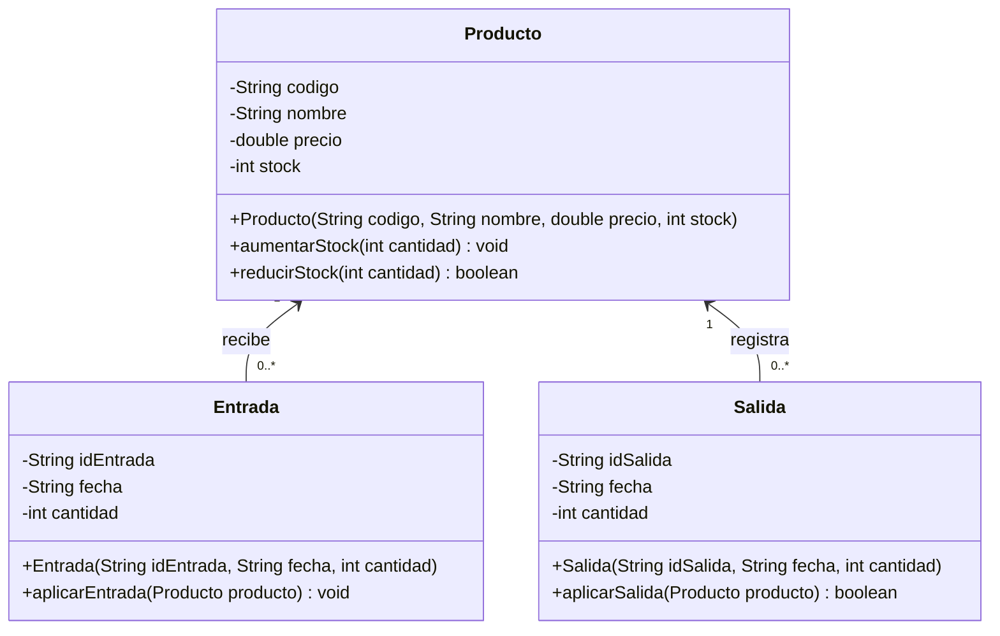

# Diagrama de clases - Sistema de Inventario

```mermaid
classDiagram

class Producto {
    -String codigo
    -String nombre
    -double precio
    -int stock
    +Producto(String codigo, String nombre, double precio, int stock)
    +aumentarStock(int cantidad) void
    +reducirStock(int cantidad) boolean
}

class Entrada {
    -String idEntrada
    -String fecha
    -int cantidad
    +Entrada(String idEntrada, String fecha, int cantidad)
    +aplicarEntrada(Producto producto) void
}

class Salida {
    -String idSalida
    -String fecha
    -int cantidad
    +Salida(String idSalida, String fecha, int cantidad)
    +aplicarSalida(Producto producto) boolean
}

Producto "1" <-- "0..*" Entrada : recibe
Producto "1" <-- "0..*" Salida : registra
```
