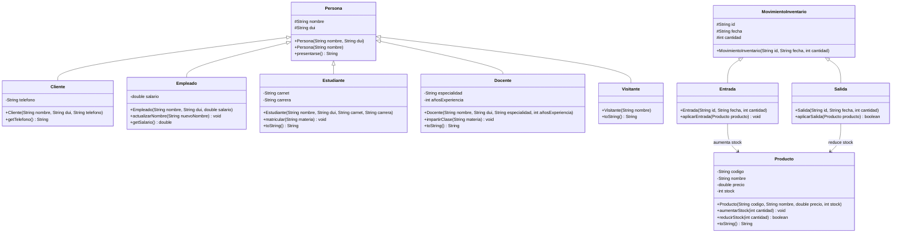

# Diagrama de clases - Semana 5

```mermaid
classDiagram

class Persona {
    #String nombre
    #String dui
    +Persona(String nombre, String dui)
    +Persona(String nombre)
    +presentarse() String
}

class Cliente {
    -String telefono
    +Cliente(String nombre, String dui, String telefono)
    +getTelefono() String
}

class Empleado {
    -double salario
    +Empleado(String nombre, String dui, double salario)
    +actualizarNombre(String nuevoNombre) void
    +getSalario() double
}

class Estudiante {
    -String carnet
    -String carrera
    +Estudiante(String nombre, String dui, String carnet, String carrera)
    +matricular(String materia) void
    +toString() String
}

class Docente {
    -String especialidad
    -int añosExperiencia
    +Docente(String nombre, String dui, String especialidad, int añosExperiencia)
    +impartirClase(String materia) void
    +toString() String
}

class Visitante {
    +Visitante(String nombre)
    +toString() String
}

class MovimientoInventario {
    #String id
    #String fecha
    #int cantidad
    +MovimientoInventario(String id, String fecha, int cantidad)
}

class Entrada {
    +Entrada(String id, String fecha, int cantidad)
    +aplicarEntrada(Producto producto) void
}

class Salida {
    +Salida(String id, String fecha, int cantidad)
    +aplicarSalida(Producto producto) boolean
}

class Producto {
    -String codigo
    -String nombre
    -double precio
    -int stock
    +Producto(String codigo, String nombre, double precio, int stock)
    +aumentarStock(int cantidad) void
    +reducirStock(int cantidad) boolean
    +toString() String
}

Persona <|-- Cliente
Persona <|-- Empleado
Persona <|-- Estudiante
Persona <|-- Docente
Persona <|-- Visitante
MovimientoInventario <|-- Entrada
MovimientoInventario <|-- Salida
Entrada --> Producto : aumenta stock
Salida --> Producto : reduce stock
```
